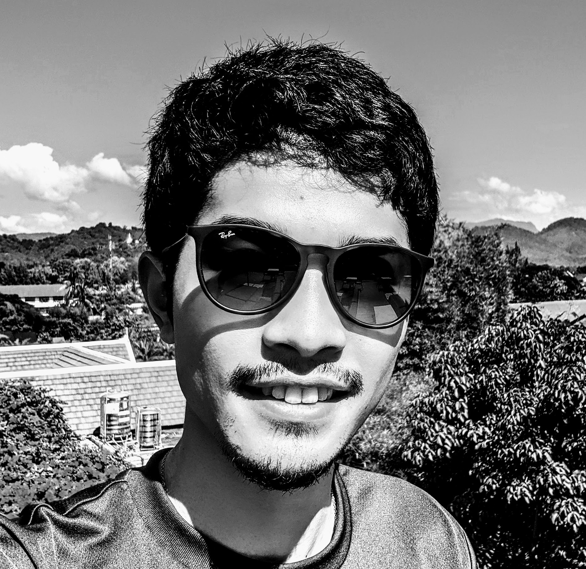

# About Me

FUJITAKE Masato (藤武将人) is a Co-Founder of Fast Accounting, Ltd., Tokyo, Japan, and Chief Research Scientist of its R&D group, FA Research.
His technical interests include computer vision, and machine learning, especially document analysis recently.

He received his Ph.D. degree in information science and technology.
He was a [Computer Vision and Discrete Geometry Group (Sugimoto Laboratory)](http://www.dgcv.nii.ac.jp/index.html) member at the National Institute of Informatics (NII), Japan.
Before commencing his graduate studies at the Graduate University for Advanced Studies, SOKENDAI,
he earned his bachelor and master’s degree in robotics and information science at the Shibaura Institute of Technology in Tokyo, Japan, where he was born and grew up.

He is enthusiastic about contributing to open-source projects, such as a model analyzer called [torchstat](https://github.com/Swall0w/torchstat) and a detection error analyzer named [Nobunaga](https://github.com/FastAccounting/nobunaga).
He is a member of IEEE and The Association for Natural Language Processing.
He is also a reviewer of IEEE conferences.

## Research Interests
- Computer Vision
- Machine Learning
- Document Analysis
- Video Analysis

# News (Past year)
- 2023/10: We present Our paper "**DiffusionSTR: Diffusion Model for Scene Text Recognition**" in IEEE ICIP2023. See you soon.
- 2023/09: Our paper "**DiffusionSTR: Diffusion Model for Scene Text Recognition**" has been available on [IEEE](https://ieeexplore.ieee.org/document/10222793)!
- 2023/09: Our paper "**DTrOCR: Decoder-only Transformer for Optical Character Recognition**" has been accepted in IEEE/CVF Winter Conference on Applications of Computer Vision (WACV) 2024! [arXiv](https://arxiv.org/abs/2308.15996)
- 2023/07: I'll present "**拡散モデルを用いたシーンテキスト認識**" in Poster **IS2-88** at [MIRU 2023](http://cvim.ipsj.or.jp/MIRU2023/program/)!
- 2023/06: Our paper "**DiffusionSTR: Diffusion Model for Scene Text Recognition**" has been accepted in IEEE ICIP 2023! [arXiv](https://arxiv.org/abs/2306.16707)
- 2023/06: Our paper "**A3S: ADVERSARIAL LEARNING OF SEMANTIC REPRESENTATIONS FOR SCENE-TEXT SPOTTING**" has  been recognized as one of the top 3% of all papers accepted at ICASSP 2023!
- 2023/05: Our paper "**A3S: ADVERSARIAL LEARNING OF SEMANTIC REPRESENTATIONS FOR SCENE-TEXT SPOTTING**" has been available on [IEEE](https://ieeexplore.ieee.org/abstract/document/10096434)!
- 2023/02: Our paper "**A3S: ADVERSARIAL LEARNING OF SEMANTIC REPRESENTATIONS FOR SCENE-TEXT SPOTTING**" has been accepted in IEEE ICASSP 2023! [arXiv](https://arxiv.org/abs/2302.10641)
- 2022/10: Our open-source project "**Nobunaga: Object Detection Analyzer**" has been available at [github](https://github.com/FastAccounting/nobunaga). It saves your detection error analysis time.

---

# Educations
<dl>
<dt>PhD in Information Science and Technology, 2022</dt>
<dd>The Graduate University for Advanced Studies, SOKENDAI</dd>
<dt>Master of Electrical, Electronic and Communications Engineering, 2019</dt>
<dd>Shibaura Institute of Technology, Tokyo</dd>
<dt>Bachelor of Electrical Engineering Technologies, 2017</dt>
<dd>Shibaura Institute of Technology, Tokyo</dd>
</dl>

# Work Experience
- Research Engineer, 2016/11 ~ 2022/03,  Fast Accounting, Japan
- Research Assistant, 2020/04 ~ 2022/02,  National Institute of Informatics, Japan
- Research Scientist, 2022/04 ~ present, Fast Accounting, Japan

